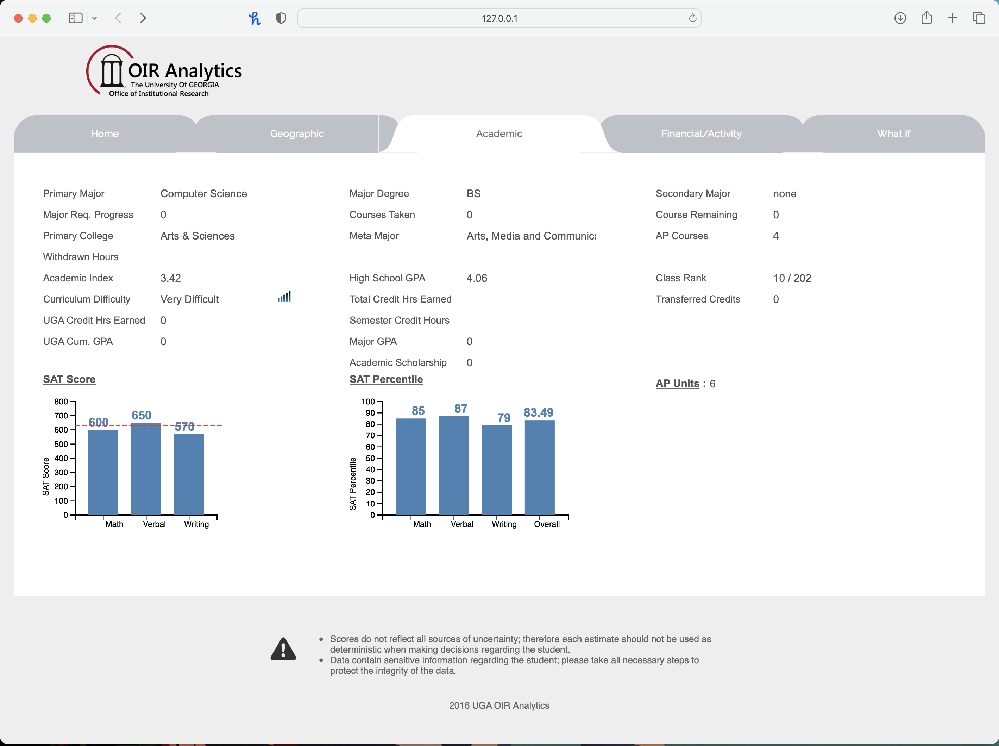
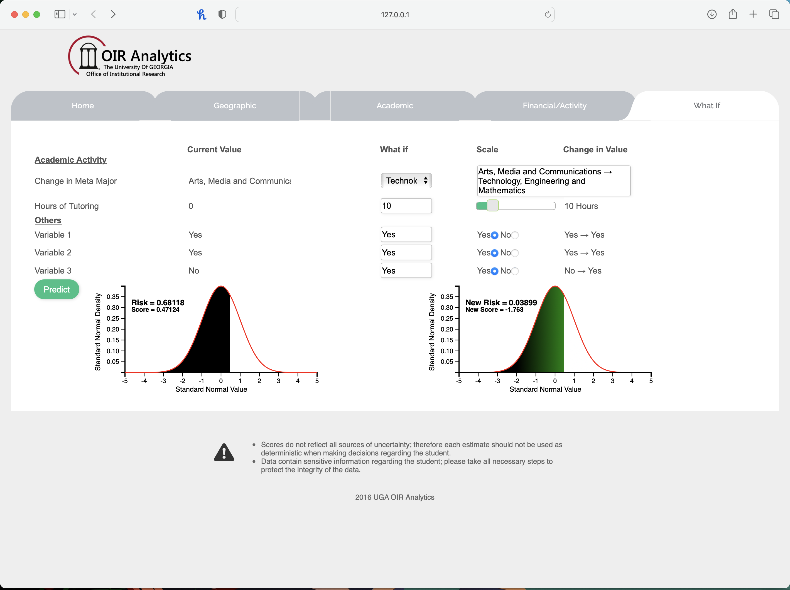
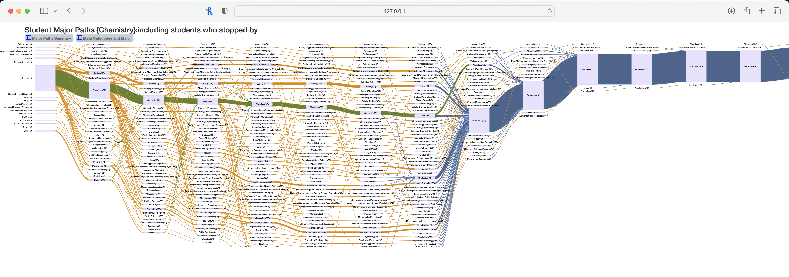
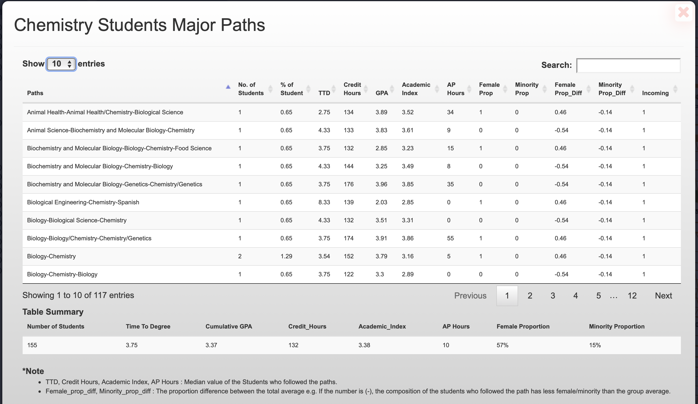

# Academic-Advising-Tool-T2D-
A Dashboard and Analytical tool to advise students to follow one of the paths for completion of their degree faster based on the graduation likelihood score for each path. Predicts student Time-to-Degree based on their course-taking patterns and course grades.

---

---

---

---

---

---

---

---

---

---
